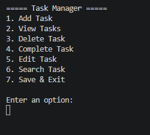

# Task Manager (C#)

A console-based Task Manager application built with C# and .NET. The application allows users to create, edit, delete, search, and manage tasks through an interactive menu. Tasks are automatically saved to a JSON file and loaded when the application starts.

## Screenshot



## Features

- Add new tasks
- View all tasks
- Edit existing tasks
- Delete tasks
- Mark tasks as completed
- Search tasks by title or description
- Automatically save tasks to a JSON file
- Automatically load saved tasks when the application starts

## Technologies Used

- C#
- .NET
- Object-Oriented Programming (OOP)
- System.Text.Json
- Git
- GitHub

## Project Structure

```
TaskManager/
├── Models/
│   └── TaskItem.cs
├── Services/
│   └── TaskService.cs
├── Program.cs
├── TaskManager.csproj
└── .gitignore
```

## Getting Started

### Prerequisites

- .NET 8 SDK or later

### Clone the repository

```bash
git clone https://github.com/sirblackbird2/TaskManager-CSharp.git
cd TaskManager-CSharp
```

### Run the application

```bash
dotnet run
```

## What I Learned

Through this project, I practiced:

- Designing applications using classes and objects
- Separating business logic from the user interface
- Working with `List<T>` collections
- Implementing CRUD operations
- Reading from and writing to JSON files
- Searching collections with case-insensitive string matching
- File handling in C#
- Version control using Git and GitHub

## Author

GitHub: **sirblackbird2**

## License

This project is for educational and portfolio purposes.
